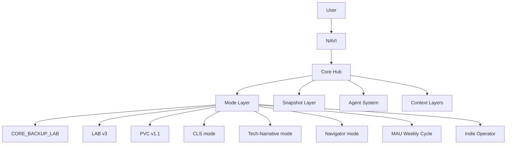

# Core Architecture Diagram

```mermaid
graph TD
  User[User] --> NAVI[NAVI]

  NAVI --> CoreHub[Core Hub]

  CoreHub --> ModeLayer[Mode Layer]
  CoreHub --> SnapshotLayer[Snapshot Layer]
  CoreHub --> Agents[Agent System]
  CoreHub --> Contexts[Context Layers]

  ModeLayer --> MODE_CORE_BACKUP[CORE_BACKUP_LAB]
  ModeLayer --> MODE_LABV3[LAB v3]
  ModeLayer --> MODE_PVC["PVC v1.1"]
  ModeLayer --> MODE_CLS[CLS mode]
  ModeLayer --> MODE_TECH[Tech-Narrative mode]
  ModeLayer --> MODE_VIC[Navigator mode]
  ModeLayer --> MODE_MAU["MAU Weekly Cycle"]
  ModeLayer --> MODE_INDIE["Indie Operator"]
```
