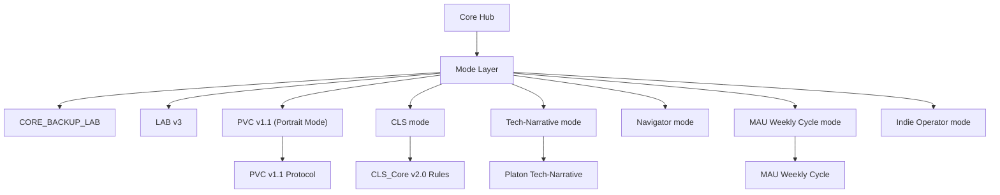

# Modes & Protocol Systems Diagram

```mermaid
graph TD
  CoreHub[Core Hub] --> ModeLayer[Mode Layer]

  ModeLayer --> MODE_CORE_BACKUP[CORE_BACKUP_LAB]
  ModeLayer --> MODE_LABV3[LAB v3]
  ModeLayer --> MODE_PVC["PVC v1.1 (Portrait Mode)"]
  ModeLayer --> MODE_CLS[CLS mode]
  ModeLayer --> MODE_TECH[Tech-Narrative mode]
  ModeLayer --> MODE_VIC[Navigator mode]
  ModeLayer --> MODE_MAU["MAU Weekly Cycle mode"]
  ModeLayer --> MODE_INDIE["Indie Operator mode"]

  MODE_PVC --> PVC_v1_1["PVC v1.1 Protocol"]
  MODE_CLS --> CLS_Rules["CLS_Core v2.0 Rules"]
  MODE_TECH --> Platon_Proto["Platon Tech-Narrative"]
  MODE_MAU --> MAU_Cycle["MAU Weekly Cycle"]
```
